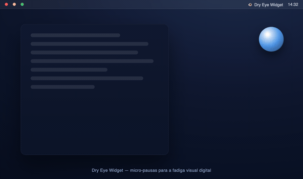
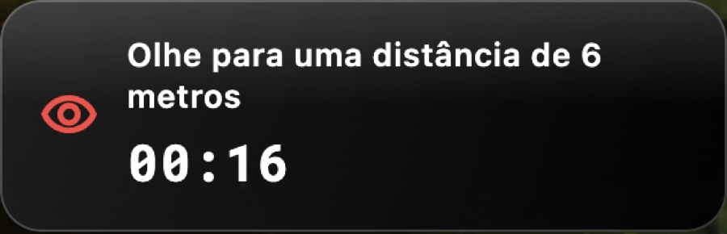
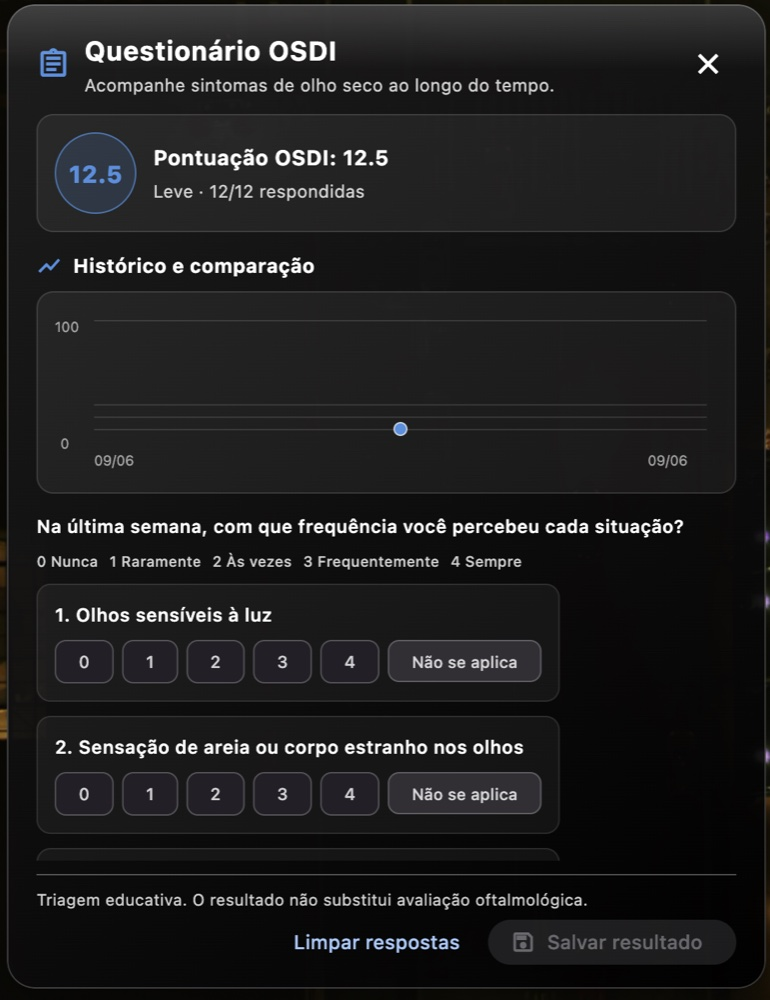
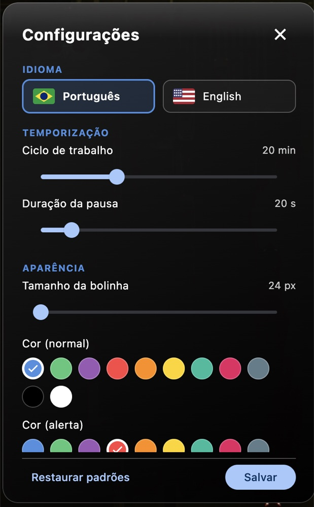
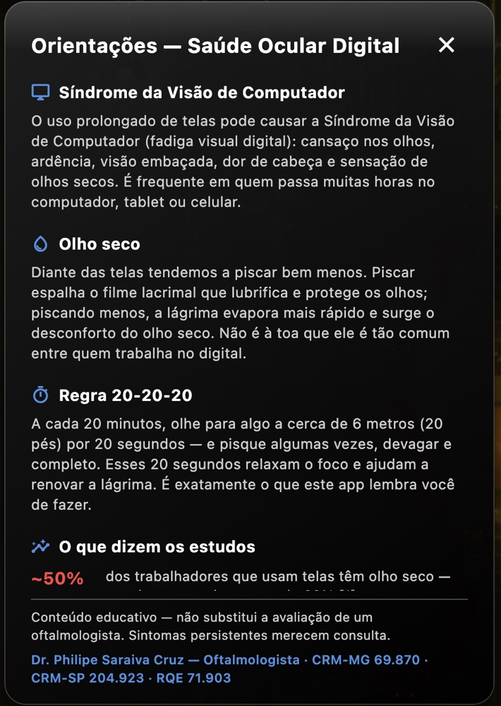
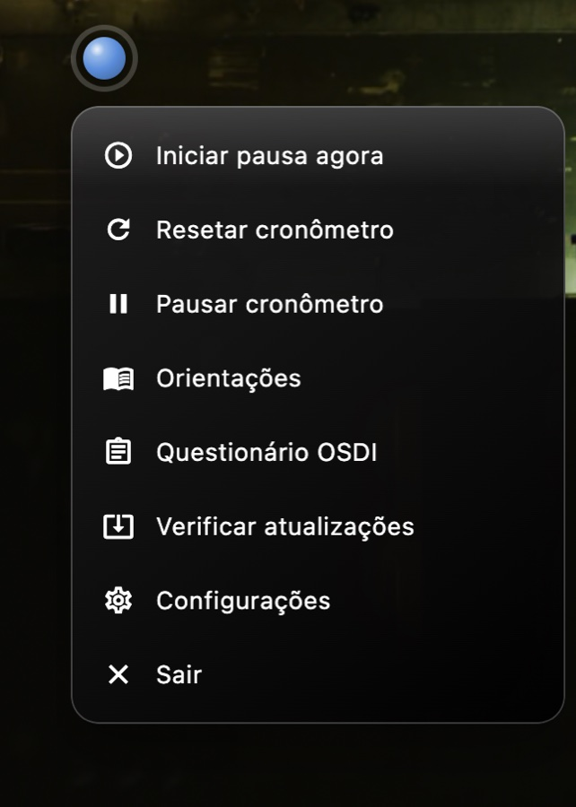

<p align="center">
  
</p>

<h1 align="center">Dry Eye Widget 👁️💧</h1>

<p align="center"><em>Prevention of Digital Eye Strain through Ocular Micro-Breaks.</em></p>

<p align="center"><a href="README.md">🇧🇷 Português</a> · <b>🇺🇸 English</b></p>

<p align="center">
  <a href="https://github.com/Sudo-psc/dry-eye-widget/releases/latest/download/DryEyeWidget.dmg"></a>
  <a href="https://github.com/Sudo-psc/dry-eye-widget/releases/latest/download/DryEyeWidget-Setup-x64.exe"></a>
  
  
  <a href="#-license"></a>
</p>

<p align="center">
A prophylactic intervention tool that implements the 20-20-20 ophthalmological rule, aiming to mitigate Computer Vision Syndrome (CVS) and Dry Eye Disease (DED) associated with prolonged screen exposure.
</p>

<p align="center">
  
</p>

<p align="center"><sub>🎬 App simulation — the work cycle, the <b>20·20·20</b> reminder with guided blinking, and the resume · <a href="docs/media/app-demo.mp4">video version (MP4)</a></sub></p>

---

## Pathophysiology and Rationale

The continuous and prolonged use of Video Display Terminals (VDTs) induces significant physiological alterations in the ocular surface and the eye's intrinsic musculature. During cognitively demanding tasks on screens, the **spontaneous blink rate is reduced by up to 60%**, while the blink amplitude frequently becomes incomplete. This dysfunction in blink dynamics leads to mechanical instability of the tear film, an increased evaporation rate, and hyperosmolarity, resulting in the desiccation of the ocular surface (Evaporative Dry Eye Disease). Concurrently, uninterrupted near-focusing leads to accommodative spasm of the ciliary muscle and convergence stress, clinically manifesting as asthenopia (visual fatigue) and transient blurred vision.

The clinical presentation of these symptoms is collectively defined as **Computer Vision Syndrome (CVS)** or **Digital Eye Strain (DES)**. From an occupational standpoint, symptomatic DED and visual fatigue have a substantial impact on work performance, resulting in significant drops in productivity (presenteeism) that can reach approximately 30% [²], alongside a documented decline in prolonged reading speed and fluency of up to 14% [³ ⁴].

### 📊 Scientific Evidence

| | |
|---:|:---|
| **~50%** | Global prevalence of Dry Eye Disease (DED) among workers using video display terminals, according to meta-analyses [¹] |
| **~30%** | Documented reduction in performance and productivity (*presenteeism*) in individuals with symptomatic dry eye [²] |
| **up to 14%** | Impairment of prolonged reading fluency and speed induced by ocular surface alterations [³ ⁴] |

The first-line prophylactic intervention, advocated by international ophthalmology and ergonomics societies, is the adherence to standardized regular visual breaks:

## The 20-20-20 Rule ⏱️

> **For every 20 minutes of screen use, the individual must shift their visual focus to an object situated at least 20 feet (approximately 6 meters) away, for a minimum duration of 20 seconds.**

**Mechanism of action:**
1. **Accommodative Relaxation:** Shifting the gaze to optical infinity (≥ 6 meters) interrupts the sustained contraction of the ciliary muscle and the convergence of extraocular muscles, alleviating biomechanical stress and asthenopia.
2. **Tear Film Restoration:** The 20-second pause actively encourages the reestablishment of the normal and complete blink rate, promoting the mechanical expression of the Meibomian glands and the subsequent lipid and aqueous redistribution over the cornea.

The primary clinical barrier to this intervention is poor behavioral adherence, largely driven by deep cognitive engagement (digital immersion). The *Dry Eye Widget* addresses this limitation directly, serving as a continuous *biofeedback* mechanism that automates and signals these therapeutic micro-breaks.

---

## 👨‍⚕️ Specialized Development

The application was conceptualized and developed by **Dr. Philipe Saraiva Cruz**, Ophthalmologist, in response to the growing incidence of DES in daily clinical practice. The software aims to translate evidence-based preventive recommendations from the clinical setting into a seamless digital solution, perfectly aligned with the modern user's workflow.

---

## 📥 Deployment and Execution

### 🍎 macOS

**➡️ [Download DMG package (DryEyeWidget.dmg)](https://github.com/Sudo-psc/dry-eye-widget/releases/latest/download/DryEyeWidget.dmg)** — Universal binary (Apple Silicon + Intel)

1. Mount the `.dmg` file and **move** the application to the **Applications** directory (`/Applications`).
2. On the initial execution, bypass the Gatekeeper quarantine restrictions by selecting the file and using the **Right-click → Open** function (the application is freely distributed and currently lacks a paid Apple digital certificate).
3. Upon initialization, a non-intrusive *widget* will be rendered in a persistent window layer (always-on-top), operating autonomously.

### 🪟 Windows

**➡️ [Download executable installer (DryEyeWidget-Setup-x64.exe)](https://github.com/Sudo-psc/dry-eye-widget/releases/latest/download/DryEyeWidget-Setup-x64.exe)** &nbsp;·&nbsp; or the **[portable compressed archive (.zip)](https://github.com/Sudo-psc/dry-eye-widget/releases/latest/download/DryEyeWidget-windows-x64.zip)** (64-bit Architecture)

1. Execute the installer. Should the **Windows SmartScreen** filter intercept execution due to the absence of a code signature, select **More info → Run anyway**.
2. Initialize the application via the shortcut in the **Start Menu**. The *widget* will dock to the screen and register a background process in the **system tray**.

> **Portable version notice:** Extract the `.zip` contents and execute via `dry_eye_widget.exe`. Ensure the structural integrity of the directory is preserved by keeping the `.dll` files and the `data\` subfolder in the same root directory as the executable.

> All release binaries are archived in **[Releases](https://github.com/Sudo-psc/dry-eye-widget/releases)**.

---

## 📸 App Screenshots

<p align="center">
  <picture>
    <source media="(prefers-color-scheme: dark)" srcset="docs/media/carousel-dark.gif">
    <source media="(prefers-color-scheme: light)" srcset="docs/media/carousel-light.gif">
    
  </picture>
</p>

<p align="center"><sub>🎞️ Real screens carousel — light/dark follows your GitHub theme · video: <a href="docs/media/carousel-dark.mp4">dark</a> · <a href="docs/media/carousel-light.mp4">light</a></sub></p>

<p align="center">
  
  
  <br>
  
  
  <br>
  
</p>

---

## ✨ Operational Dynamics

- 🔵 **Persistent Interface:** The *widget* operates in an *overlay* mode with a transparent background, ensuring continuous status visibility without blocking underlying OS events.
- ⏰ **Alert Cycles:** Every **20 minutes** (customizable parameter), the visual signaling of the *widget* transitions to an alert state, actively prompting a visual micro-break and the performance of voluntary blinks.
- 🧘 **Integrated Timer:** A countdown chronometer guides the physiological resting process for 20 seconds. Upon completion, the underlying cycles are automatically rearmed.
- 👁️ **Tray Control:** An integrated node in the menu bar/system tray provides real-time monitoring of metabolic progress and global overlay control options (pause, reset, etc.).

### Configurable Parameters ⚙️

The *widget* engine offers a flexible configuration architecture: modulation of the cycle timing, adjustment of the *overlay* radius, state color matrix (idle/alert), rendering settings (translucent *liquid glass* mode vs. darkened background), boot initialization coupling, and inactivity control, ensuring optimal adherence to varied workflows.

---

## 💚 Clinical Consideration

This application is strictly a **prophylactic support tool**, functioning to modulate occupational habits and does not constitute a medical device intended for diagnostic or curative purposes. In cases of chronic asthenopia, sustained hyperemia, or symptomatic tear film instability, it is imperative to **seek a specialized ophthalmological evaluation**.

---

## 🛠️ Technical Specifications (Developers)

The infrastructure is built upon **Flutter** (*desktop-first*), natively supporting macOS and Windows.

```bash
flutter pub get
flutter run -d macos      # or -d windows
```

Build Pipeline:

```bash
flutter build macos --release         # Compiles universal binary (arm64 + x86_64)
./scripts/make_dmg.sh                  # Packages the structural dist/DryEyeWidget.dmg
flutter build windows --release        # Produces x64 standalone binary
```

Architecture and Dependencies: The project complies with `flutter analyze` without warnings. It employs reactive dependency injection via `provider`. Advanced OS window control utilizes `window_manager` interfaced with `flutter_acrylic` (for transparent *liquid glass* effects). Tray communication is handled by `tray_manager`, audio events by `audioplayers`, notification bus by the `local_notifier` package, and inactivity observability via cross-platform native channels.

> **Prerequisites:** Compiling for Windows requires **Visual Studio 2022** with the "Desktop development with C++" workload operating under a Windows OS. Compiling for macOS requires **Xcode** via an Apple host infrastructure.

---

## 📚 Bibliographic References

1. Courtin R, et al. **Prevalence of dry eye disease in visual display terminal
   workers: a systematic review and meta-analysis.** *BMJ Open.* 2016;6(1):e009675.
   [doi:10.1136/bmjopen-2015-009675](https://doi.org/10.1136/bmjopen-2015-009675)
2. Nichols KK, et al. **Impact of Dry Eye Disease on Work Productivity, and
   Patients' Satisfaction With Over-the-Counter Dry Eye Treatments.** *Invest
   Ophthalmol Vis Sci.* 2016;57(7):2975-82.
   [doi:10.1167/iovs.16-19419](https://doi.org/10.1167/iovs.16-19419)
3. Mathews PM, et al. **Functional impairment of reading in patients with dry
   eye.** *Br J Ophthalmol.* 2016;101(4):481-6.
   [doi:10.1136/bjophthalmol-2015-308237](https://doi.org/10.1136/bjophthalmol-2015-308237)
4. Karakus S, et al. **Impact of Dry Eye on Prolonged Reading.** *Optom Vis Sci.*
   2018;95(12):1105-13.
   [doi:10.1097/OPX.0000000000001303](https://doi.org/10.1097/OPX.0000000000001303)

<sub>Reference metadata file in RIS format available at:
[`docs/referencias.ris`](docs/referencias.ris).</sub>

## ⚖️ Legal

- [Terms of Use](docs/legal/termos-de-uso.md) (Portuguese)
- [Privacy Policy](docs/PRIVACY.md)

## 🆓 Licensing

**Open Distribution Code.** Open-source architecture governed under the **MIT** License — guaranteeing unrestricted prerogatives for use, replication, code auditing, and commercial or non-commercial derivation. The fundamental goal of this tool is to universalize ergonomic care. 💙

## 🔏 Code Signing

Code signing for the Windows installer is provided by the **SignPath
Foundation** (free program for open-source projects), reducing SmartScreen
"unknown publisher" warnings.

> Free code signing provided by [SignPath.io](https://about.signpath.io), certificate by [SignPath Foundation](https://signpath.org)

Team roles, the release approval process and privacy are described in our
[Code Signing Policy](docs/legal/code-signing-policy.en.md).

## 👨‍⚕️ Scientific Authorship

Conceptualized and clinically documented by **Dr. Philipe Saraiva Cruz** — Ophthalmologist · CRM-MG 69.870 · CRM-SP 204.923 · RQE 71.903
