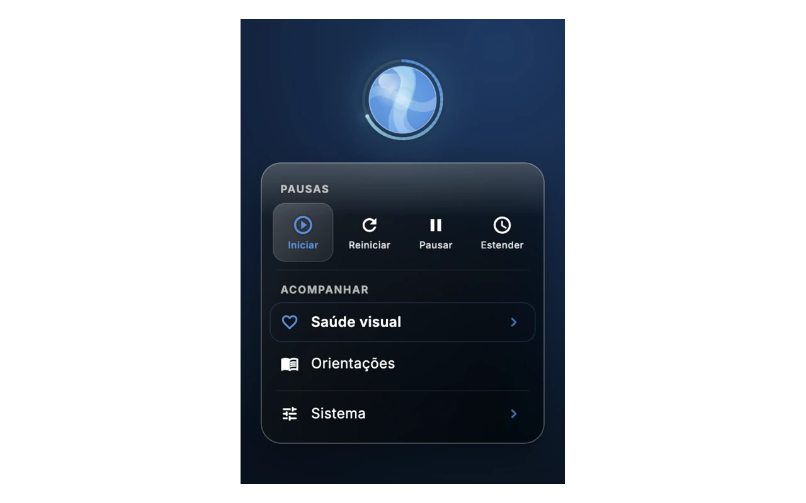
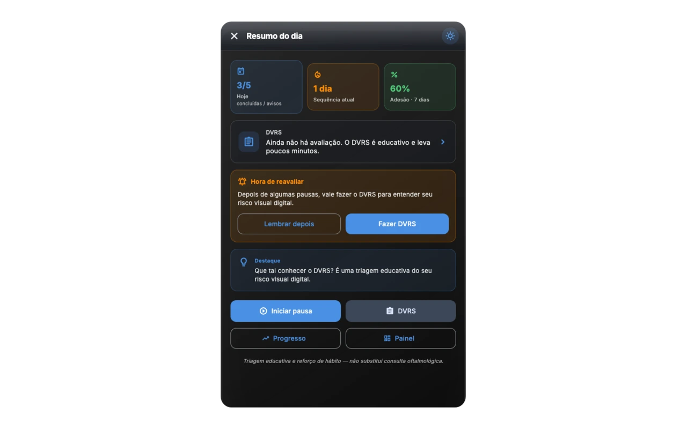

<p align="center">
  
</p>

<h1 align="center">Dry Eye Widget</h1>

<p align="center">
  <em>A gentle 20-20-20 reminder for digital eye strain and dry eye.</em><br>
  <strong>Version 1.26.0</strong> · open source (MIT) · 100% local · macOS &amp; Windows
</p>

<p align="center">
  <a href="README.md">🇧🇷 Português</a> · <b>🇺🇸 English</b>
</p>

<p align="center">
  <a href="https://olhossecos.com.br/app/"></a>
  <a href="https://github.com/Sudo-psc/dry-eye-widget/releases/latest"></a>
  <a href="https://github.com/Sudo-psc/dry-eye-widget/actions/workflows/ci.yml"></a>
  
  <a href="#license"></a>
</p>

<p align="center">
  <a href="https://github.com/Sudo-psc/dry-eye-widget/releases/latest/download/DryEyeWidget.dmg"></a>
  <a href="https://apps.microsoft.com/detail/9nnk9spjz3qv"></a>
  <a href="https://github.com/Sudo-psc/dry-eye-widget/releases/latest/download/DryEyeWidget-Setup-x64.exe"></a>
</p>

<p align="center">
  
</p>

<p align="center"><sub>Demo · <a href="docs/media/landing-demo.mp4">MP4</a> · site: <a href="https://olhossecos.com.br/app/">olhossecos.com.br/app</a></sub></p>

---

## What it is

An always-on-top floating ball that applies the **20-20-20 rule** to your workday: every 20 minutes, it reminds you to look about 6 meters away for 20 seconds. Built by an **ophthalmologist** to support preventive habits — **it does not diagnose and does not replace a clinical visit**.

Runs **offline**, with no usage telemetry by default. Breaks, DVRS self-reports and screen-time data stay on your machine.

---

## Why it exists

On screens, the **spontaneous blink rate can drop by up to ~60%** and the tear film evaporates faster — burning, blurred vision and end-of-day fatigue. That overlaps with **Computer Vision Syndrome (CVS)** and evaporative **Dry Eye Disease (DED)** linked to VDTs.

| Evidence | Source |
|----------|--------|
| **~50%** DED prevalence among VDT workers | Meta-analysis [¹] |
| **~30%** productivity loss (presenteeism) with symptomatic dry eye | [²] |
| **Up to 14%** impairment in prolonged reading | [³ ⁴] |

First-line prevention is the **20-20-20 rule**. The real barrier is **adherence** — this widget exists to remind you without getting in the way.

### The 20-20-20 rule

> Every **20 minutes** of screen time → look **20 feet (~6 m)** away → for **20 seconds**.

1. **Relaxes** accommodation and convergence (less asthenopia).  
2. **Encourages** complete blinks and tear-film redistribution.

---

## Features (1.26.0)

- **Floating widget** with progress ring, always-on-top, system tray  
- **Configurable cycles and look** (interval, colors, opacity, glass)  
- **Half-moon edge snap** (discreet; one click undocks)  
- **Guided break** (full overlay or gentle corner card)  
- **Blink reminder** (visual and/or sound; adjustable frequency)  
- **Meeting mode** — stretch the cycle for 1 hour  
- **DVRS** — 16-question educational self-report of symptoms and habits (**not a diagnosis**)
- **Day summary** and local insights  
- **PDF report** for your ophthalmologist (generated locally)  
- **Screen time** and activity (opt-in)  
- **Visual health hub** (today, progress, screen/DVRS) and **My data** (local export/erase)
- **i18n** PT / EN  

Landing with macOS and Windows captures: [olhossecos.com.br/app](https://olhossecos.com.br/app/)

---

## Download and install

### macOS

1. Download [**DryEyeWidget.dmg**](https://github.com/Sudo-psc/dry-eye-widget/releases/latest/download/DryEyeWidget.dmg) (universal Apple Silicon + Intel).  
2. Open the `.dmg` and drag to **Applications**.  
3. **Gatekeeper (app not yet paid-Apple notarized):** if macOS says the file “is damaged”, in Terminal:

```bash
xattr -cr ~/Downloads/DryEyeWidget*.dmg
# if already in Applications:
xattr -cr "/Applications/Dry Eye Widget.app"
```

The same instructions ship inside the DMG volume. Signing pipeline: [`docs/CODE_SIGNING.md`](docs/CODE_SIGNING.md).

### Windows

| Channel | Link |
|---------|------|
| **Microsoft Store** (recommended) | [Dry Eye Widget on the Store](https://apps.microsoft.com/detail/9nnk9spjz3qv) |
| x64 installer | [DryEyeWidget-Setup-x64.exe](https://github.com/Sudo-psc/dry-eye-widget/releases/latest/download/DryEyeWidget-Setup-x64.exe) |
| Portable ZIP | [DryEyeWidget-windows-x64.zip](https://github.com/Sudo-psc/dry-eye-widget/releases/latest/download/DryEyeWidget-windows-x64.zip) |

On the GitHub installer, if **SmartScreen** warns: *More info → Run anyway* (until Authenticode signing is active). Details: [`win_version/CODE_SIGNING.md`](win_version/CODE_SIGNING.md).

For the portable ZIP, keep `dry_eye_widget.exe`, DLLs and the `data\` folder together.

All builds: **[Releases](https://github.com/Sudo-psc/dry-eye-widget/releases)**.

---

## Screenshots

<p align="center">
  
  
</p>

<p align="center"><sub>Current v1.26.0 interface · widget, quick actions, menu and daily summary · <a href="https://olhossecos.com.br/app/#capturas">see all macOS and Windows screenshots</a></sub></p>

---

## Clinical note

This is a **preventive habit-support tool** — **not** a diagnostic device or treatment. For persistent eye discomfort, blurred vision or suspected dry eye, **see an ophthalmologist**.

Authorship: **Philipe Saraiva Cruz, MD** — ophthalmologist · CRM-MG 69.870 · CRM-SP 204.923 · RQE 71.903

---

## Development

Stack: **Flutter desktop** (macOS / Windows), `provider`, `window_manager`, `flutter_acrylic`, `tray_manager`, `local_notifier`, `audioplayers`.

```bash
flutter pub get
flutter analyze
flutter test
flutter run -d macos    # or -d windows
```

### Release builds

```bash
# macOS
flutter build macos --release
./scripts/make_dmg.sh                 # → dist/DryEyeWidget.dmg
# with Developer ID configured (optional):
# MACOS_SIGNING_ENABLED=true MACOS_IDENTITY="..." ./scripts/macos_sign_and_notarize.sh

# Windows (on a Windows host + VS 2022 “Desktop development with C++”)
flutter build windows --release
# Installer: Inno Setup with win_version/templates/dry-eye-widget.iss
```

### CI and useful docs

| Doc | Content |
|-----|---------|
| [`docs/ROADMAP.md`](docs/ROADMAP.md) | Now / Next / Later priorities |
| [`docs/CODE_SIGNING.md`](docs/CODE_SIGNING.md) | macOS + Windows signing in CI |
| [`docs/QA-WINDOWS.md`](docs/QA-WINDOWS.md) | Docking & blink micro-notification checklist |
| [`docs/IMPROVEMENT-AUTOMATION.md`](docs/IMPROVEMENT-AUTOMATION.md) | Workflows and automation |
| [`docs/lighthouse/LATEST.md`](docs/lighthouse/LATEST.md) | Landing Lighthouse baseline |
| [`CHANGELOG.md`](CHANGELOG.md) | Version history |
| [`site/README.md`](site/README.md) | Static landing: layout, smoke, Pages deploy |

Requirements: **Xcode** (macOS) · **Visual Studio 2022** with C++ (Windows). Flutter **≥ 3.44**.

---

## Privacy and legal

- **Local** processing; the app does not ship usage data to servers.  
- [Terms of Use](docs/legal/termos-de-uso.md) · [Privacy Policy](docs/legal/politica-de-privacidade.md) · [docs/PRIVACY.md](docs/PRIVACY.md) · [SECURITY.md](SECURITY.md)

---

## References

1. Courtin R, et al. Prevalence of dry eye disease in visual display terminal workers: a systematic review and meta-analysis. *BMJ Open.* 2016;6(1):e009675. [doi:10.1136/bmjopen-2015-009675](https://doi.org/10.1136/bmjopen-2015-009675)  
2. Nichols KK, et al. Impact of Dry Eye Disease on Work Productivity… *Invest Ophthalmol Vis Sci.* 2016;57(7):2975-82. [doi:10.1167/iovs.16-19419](https://doi.org/10.1167/iovs.16-19419)  
3. Mathews PM, et al. Functional impairment of reading in patients with dry eye. *Br J Ophthalmol.* 2016;101(4):481-6. [doi:10.1136/bjophthalmol-2015-308237](https://doi.org/10.1136/bjophthalmol-2015-308237)  
4. Karakus S, et al. Impact of Dry Eye on Prolonged Reading. *Optom Vis Sci.* 2018;95(12):1105-13. [doi:10.1097/OPX.0000000000001303](https://doi.org/10.1097/OPX.0000000000001303)  
5. Talens-Estarelles C, et al. The effects of breaks on digital eye strain… Testing the 20-20-20 rule. *Cont Lens Anterior Eye.* 2023;46(2):101744. [doi:10.1016/j.clae.2022.101744](https://doi.org/10.1016/j.clae.2022.101744)  
6. Alabdulkader B. Effect of digital device use during COVID-19 on digital eye strain. *Clin Exp Optom.* 2021;104(6):698-704. [doi:10.1080/08164622.2021.1878843](https://doi.org/10.1080/08164622.2021.1878843)

RIS metadata: [`docs/referencias.ris`](docs/referencias.ris).

---

## License

**MIT** — free to use, study, modify and redistribute. The goal is to make visual ergonomics care more accessible.

Conceived and clinically documented by **Philipe Saraiva Cruz, MD**.
