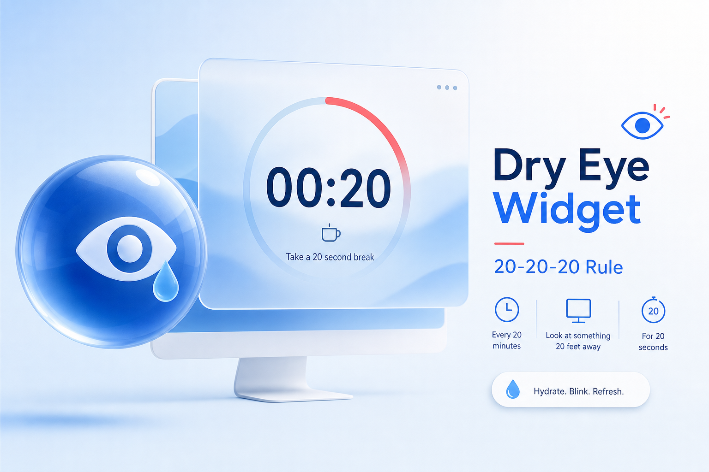
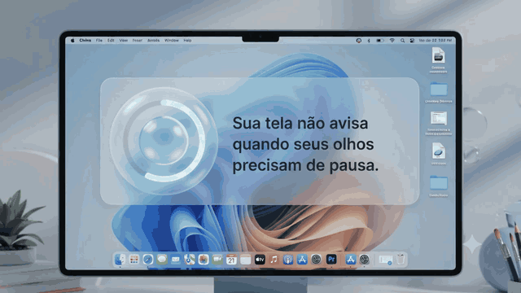
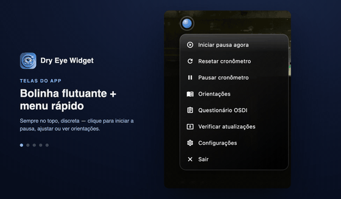

<p align="center">
  
</p>

<h1 align="center">Dry Eye Widget</h1>

<p align="center">
  <em>Lembrete gentil da regra 20-20-20 para fadiga visual digital e olho seco.</em><br>
  <strong>Versão 1.24.0</strong> · open source (MIT) · 100% local · macOS &amp; Windows
</p>

<p align="center">
  <b>🇧🇷 Português</b> · <a href="README.en.md">🇺🇸 English</a>
</p>

<p align="center">
  <a href="https://olhossecos.com.br/app/"></a>
  <a href="https://github.com/Sudo-psc/dry-eye-widget/releases/latest"></a>
  <a href="https://github.com/Sudo-psc/dry-eye-widget/actions/workflows/ci.yml"></a>
  
  <a href="#licença"></a>
</p>

<p align="center">
  <a href="https://github.com/Sudo-psc/dry-eye-widget/releases/latest/download/DryEyeWidget.dmg"></a>
  <a href="https://apps.microsoft.com/detail/9nnk9spjz3qv"></a>
  <a href="https://github.com/Sudo-psc/dry-eye-widget/releases/latest/download/DryEyeWidget-Setup-x64.exe"></a>
</p>

<p align="center">
  
</p>

<p align="center"><sub>Demonstração · <a href="docs/media/landing-demo.mp4">MP4</a> · site: <a href="https://olhossecos.com.br/app/">olhossecos.com.br/app</a></sub></p>

---

## O que é

Uma bolinha flutuante always-on-top que aplica a **regra 20-20-20** no seu fluxo de trabalho: a cada 20 minutos, lembra de olhar para ~6 metros por 20 segundos. Criada por um **médico oftalmologista** para apoiar hábitos preventivos — **não diagnostica e não substitui consulta**.

Funciona **offline**, sem telemetria por padrão. Dados (pausas, DVRS, tempo de tela) ficam na sua máquina.

---

## Por que existe

Em telas, a **piscada espontânea pode cair até ~60%** e o filme lacrimal evapora mais rápido — ardência, visão turva e cansaço ao fim do dia. Isso se soma à **Síndrome da Visão de Computador (CVS)** e à **Doença do Olho Seco (DED)** evaporativa ligada a VDT.

| Evidência | Fonte |
|-----------|--------|
| **~50%** de prevalência de DED em trabalhadores com terminais de vídeo | Meta-análise [¹] |
| **~30%** de queda de produtividade (presenteísmo) com olho seco sintomático | [²] |
| **Até 14%** de comprometimento na leitura prolongada | [³ ⁴] |

A intervenção de primeira linha recomendada é a **regra 20-20-20**. A barreira real é a **adesão** — o widget existe para lembrá-lo sem atrapalhar.

### A regra 20-20-20

> A cada **20 minutos** de tela → olhe a **20 pés (~6 m)** → por **20 segundos**.

1. **Relaxa** acomodação e convergência (menos astenopia).  
2. **Estimula** piscadas completas e redistribuição do filme lacrimal.

---

## Recursos (1.23)

- **Widget flutuante** com anel de progresso, always-on-top, bandeja do sistema  
- **Ciclos e aparência** configuráveis (intervalo, cores, opacidade, vidro)  
- **Encaixe meia-lua** nas bordas laterais (discreto; um clique solta)  
- **Pausa guiada** (overlay ou modo suave no canto)  
- **Lembrete de piscada** (visual e/ou som; frequência ajustável)  
- **Modo reunião** — alonga o ciclo por 1 hora  
- **DVRS** — Índice de Risco Visual Digital (triagem educativa 16 perguntas, **não é diagnóstico**)  
- **Resumo do dia** e insights locais  
- **Relatório em PDF** para levar ao oftalmologista (gerado localmente)  
- **Tempo de tela** e atividade (opt-in)  
- **Hub de saúde** (hoje, progresso, tela/DVRS) e **Meus dados** (exportar/apagar local)  
- **i18n** PT / EN  

Landing com capturas macOS e Windows: [olhossecos.com.br/app](https://olhossecos.com.br/app/)

---

## Download e instalação

### macOS

1. Baixe o [**DryEyeWidget.dmg**](https://github.com/Sudo-psc/dry-eye-widget/releases/latest/download/DryEyeWidget.dmg) (universal Apple Silicon + Intel).  
2. Abra o `.dmg` e arraste para **Aplicativos**.  
3. **Gatekeeper (app ainda sem notarização paga da Apple):** se o sistema disser que o arquivo “está danificado”, no Terminal:

```bash
xattr -cr ~/Downloads/DryEyeWidget*.dmg
# se já estiver em Aplicativos:
xattr -cr "/Applications/Dry Eye Widget.app"
```

Instruções também estão dentro do volume do DMG. Pipeline de assinatura: [`docs/CODE_SIGNING.md`](docs/CODE_SIGNING.md).

### Windows

| Canal | Link |
|-------|------|
| **Microsoft Store** (recomendado) | [Dry Eye Widget na Store](https://apps.microsoft.com/detail/9nnk9spjz3qv) |
| Instalador x64 | [DryEyeWidget-Setup-x64.exe](https://github.com/Sudo-psc/dry-eye-widget/releases/latest/download/DryEyeWidget-Setup-x64.exe) |
| Portátil ZIP | [DryEyeWidget-windows-x64.zip](https://github.com/Sudo-psc/dry-eye-widget/releases/latest/download/DryEyeWidget-windows-x64.zip) |

No instalador GitHub, se o **SmartScreen** avisar: *Mais informações → Executar assim mesmo* (enquanto não houver assinatura Authenticode ativa). Detalhes: [`win_version/CODE_SIGNING.md`](win_version/CODE_SIGNING.md).

No ZIP portátil, mantenha `dry_eye_widget.exe`, as DLLs e a pasta `data\` juntos.

Todas as versões: **[Releases](https://github.com/Sudo-psc/dry-eye-widget/releases)**.

---

## Telas

<p align="center">
  <picture>
    <source media="(prefers-color-scheme: dark)" srcset="docs/media/carousel-dark.gif">
    <source media="(prefers-color-scheme: light)" srcset="docs/media/carousel-light.gif">
    
  </picture>
</p>

<p align="center"><sub>Tema claro/escuro segue o GitHub · <a href="docs/media/carousel-dark.mp4">vídeo escuro</a> · <a href="docs/media/carousel-light.mp4">vídeo claro</a></sub></p>

---

## Consideração clínica

Ferramenta de **apoio preventivo e mudança de hábito** — **não** é dispositivo diagnóstico nem tratamento. Em desconforto ocular persistente, visão turva ou suspeita de olho seco, **procure um oftalmologista**.

Autoria: **Dr. Philipe Saraiva Cruz** — médico oftalmologista · CRM-MG 69.870 · CRM-SP 204.923 · RQE 71.903

---

## Desenvolvimento

Stack: **Flutter desktop** (macOS / Windows), `provider`, `window_manager`, `flutter_acrylic`, `tray_manager`, `local_notifier`, `audioplayers`.

```bash
flutter pub get
flutter analyze
flutter test
flutter run -d macos    # ou -d windows
```

### Builds de release

```bash
# macOS
flutter build macos --release
./scripts/make_dmg.sh                 # → dist/DryEyeWidget.dmg
# com Developer ID configurado (opcional):
# MACOS_SIGNING_ENABLED=true MACOS_IDENTITY="..." ./scripts/macos_sign_and_notarize.sh

# Windows (em host Windows + VS 2022 “Desktop development with C++”)
flutter build windows --release
# Instalador: Inno Setup com win_version/templates/dry-eye-widget.iss
```

### CI e documentação útil

| Documento | Conteúdo |
|-----------|----------|
| [`docs/ROADMAP.md`](docs/ROADMAP.md) | Prioridades Now / Next / Later |
| [`docs/CODE_SIGNING.md`](docs/CODE_SIGNING.md) | Assinatura macOS + Windows no CI |
| [`docs/QA-WINDOWS.md`](docs/QA-WINDOWS.md) | Checklist docking e micronotificação |
| [`docs/IMPROVEMENT-AUTOMATION.md`](docs/IMPROVEMENT-AUTOMATION.md) | Workflows e automações |
| [`docs/lighthouse/LATEST.md`](docs/lighthouse/LATEST.md) | Lighthouse da landing |
| [`CHANGELOG.md`](CHANGELOG.md) | Histórico de versões |
| [`site/README.md`](site/README.md) | Landing estática: estrutura, smoke, deploy Pages |

Pré-requisitos: **Xcode** (macOS) · **Visual Studio 2022** com C++ (Windows). Flutter **≥ 3.44**.

---

## Privacidade e legal

- Processamento **local**; sem coleta de dados de uso enviada a servidores pelo app.  
- [Termos de Uso](docs/legal/termos-de-uso.md) · [Política de Privacidade](docs/legal/politica-de-privacidade.md) · [docs/PRIVACY.md](docs/PRIVACY.md) · [SECURITY.md](SECURITY.md)

---

## Referências

1. Courtin R, et al. Prevalence of dry eye disease in visual display terminal workers: a systematic review and meta-analysis. *BMJ Open.* 2016;6(1):e009675. [doi:10.1136/bmjopen-2015-009675](https://doi.org/10.1136/bmjopen-2015-009675)  
2. Nichols KK, et al. Impact of Dry Eye Disease on Work Productivity… *Invest Ophthalmol Vis Sci.* 2016;57(7):2975-82. [doi:10.1167/iovs.16-19419](https://doi.org/10.1167/iovs.16-19419)  
3. Mathews PM, et al. Functional impairment of reading in patients with dry eye. *Br J Ophthalmol.* 2016;101(4):481-6. [doi:10.1136/bjophthalmol-2015-308237](https://doi.org/10.1136/bjophthalmol-2015-308237)  
4. Karakus S, et al. Impact of Dry Eye on Prolonged Reading. *Optom Vis Sci.* 2018;95(12):1105-13. [doi:10.1097/OPX.0000000000001303](https://doi.org/10.1097/OPX.0000000000001303)  
5. Talens-Estarelles C, et al. The effects of breaks on digital eye strain… Testing the 20-20-20 rule. *Cont Lens Anterior Eye.* 2023;46(2):101744. [doi:10.1016/j.clae.2022.101744](https://doi.org/10.1016/j.clae.2022.101744)  
6. Alabdulkader B. Effect of digital device use during COVID-19 on digital eye strain. *Clin Exp Optom.* 2021;104(6):698-704. [doi:10.1080/08164622.2021.1878843](https://doi.org/10.1080/08164622.2021.1878843)

Metadados RIS: [`docs/referencias.ris`](docs/referencias.ris).

---

## Licença

**MIT** — uso, estudo, modificação e redistribuição livres. O objetivo é universalizar o cuidado ergonômico visual.

Concebido e documentado clinicamente pelo **Dr. Philipe Saraiva Cruz**.
