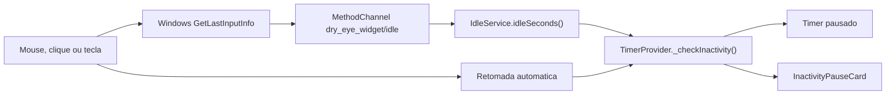

# Modulo de Inatividade do Timer

Este README descreve o modulo de inatividade do Dry Eye Widget: a parte do app que detecta quando o usuario se afastou do computador, pausa o ciclo da regra 20-20-20 e retoma o timer quando o usuario volta a usar mouse, teclado ou touchpad.

Para a especificacao tecnica completa, veja [inactivity-timer-spec.md](../inactivity-timer-spec.md).

## Atualizacao (v1.7.x) — motor adaptativo, camera opcional e cifra

A partir da v1.7.0 o motor de inatividade evoluiu. O **limiar fixo de 120 s**
descrito abaixo deixou de ser fixo e virou o **valor de cold start**; o resto
desta secao prevalece sobre os limiares fixos citados mais adiante:

- **Limiar adaptativo (on-device):** o tempo ate pausar e aprendido
  continuamente a partir dos padroes do usuario, por faixa horaria (estatistica
  online leve — histograma compacto / percentil P85). Comeca em 120 s (cold
  start) e se ajusta dentro de `[60 s, 600 s]`. Implementado em
  `AdaptiveThresholdModel`, orquestrado pelo `PresenceController` (sensores
  plugaveis via `PresenceSensor`: `InputIdleSensor` e camera opcional).
- **Presenca pela camera (opcional, opt-in, desligada por padrao):** quando o
  input fica ocioso no limiar, um **snapshot pontual** confirma presenca via
  deteccao de rosto on-device (macOS/Vision — `VisionService` +
  `CameraPresenceSensor`), evitando pausas indevidas enquanto o usuario le a
  tela. A imagem e processada e **descartada na hora**; nada e gravado nem
  enviado. Pede consentimento explicito antes da permissao do SO. Disponivel no
  macOS; no Windows o toggle aparece desabilitado.
- **Persistencia cifrada do aprendizado:** o estado agregado do modelo (apenas
  contagens, sem eventos brutos nem timeline) e guardado **cifrado em repouso**
  pelo SO (Keychain no macOS, DPAPI no Windows) via `SecurePresenceStore`, sem
  acesso remoto. Ha botao para **resetar o aprendizado** nas Configuracoes.

O cartao de aviso, a histerese de retomada (`inactivityResumeSeconds`) e a
retomada manual permanecem como descrito a seguir.

## Objetivo

O timer deve contar apenas tempo ativo de exposicao a tela. Quando o usuario fica longe do teclado e da tela, o app deve congelar o ciclo para evitar alertas falsos. Ao detectar nova atividade, o app retoma automaticamente de onde parou.

## Comportamento Esperado

- O app monitora a inatividade global do sistema operacional.
- Apos 120 segundos sem entrada do usuario, o timer entra em pausa por inatividade.
- Enquanto pausado, `cycleElapsed` nao aumenta.
- O progresso visual da bolinha e do tray fica congelado.
- Um aviso pequeno aparece no canto superior direito.
- O aviso informa que o timer foi pausado por inatividade.
- O aviso inclui um botao pequeno `Retomar`.
- O timer retoma automaticamente quando houver movimento do cursor, clique, scroll, tecla ou touchpad.
- O botao `Retomar` tambem pode limpar a pausa manualmente.
- A pausa por inatividade nao reseta o ciclo e nao dispara som.

## Experiencia do Usuario

O aviso deve ser discreto e nao bloqueante. Ele nao deve aparecer como tela cheia, modal central ou overlay escuro.

Texto sugerido em PT-BR:

```text
Timer pausado
Inatividade detectada. O ciclo sera retomado quando voce voltar.
Retomar
```

Texto sugerido em EN:

```text
Timer paused
Inactivity detected. The cycle will resume when you return.
Resume
```

## Arquitetura

O modulo tem tres camadas:

1. **Nativa Windows:** mede o tempo desde a ultima entrada do usuario.
2. **Servico Dart:** encapsula a leitura nativa em uma API simples.
3. **Provider/UI:** congela o timer e mostra o aviso compacto.



## Arquivos Envolvidos

| Arquivo | Responsabilidade |
|---|---|
| `windows/runner/flutter_window.cpp` | Implementa o canal nativo `dry_eye_widget/idle` no Windows |
| `lib/services/idle_service.dart` | Expoe `idleSeconds()` para o Dart |
| `lib/providers/timer_provider.dart` | Decide quando pausar e retomar o timer |
| `lib/utils/constants.dart` | Define limites como `inactivitySeconds` |
| `lib/l10n/app_strings.dart` | Guarda textos PT-BR/EN do aviso |
| `lib/main.dart` | Escolhe qual UI mostrar e ajusta o layout da janela |
| `lib/widgets/inactivity_pause_card.dart` | Widget compacto do aviso de inatividade |

## Estado Atual

Base ja existente:

- Canal nativo `dry_eye_widget/idle` no Windows.
- `IdleService.idleSeconds()`.
- Flag `pauseOnInactivity`.
- Pausa automatica parcial no `TimerProvider`.
- Textos de inatividade em `AppStrings`.

Ainda falta implementar:

- Card visual dedicado `InactivityPauseCard`.
- Botao `Retomar`.
- Metodo `resumeFromInactivity()`.
- Histerese de retomada automatica.
- Layout pequeno `_WindowLayout.inactivity`.
- Testes unitarios e widget tests especificos.

## Regras de Estado

O timer principal continua usando:

```text
idle -> alerta -> fase1 -> conclusao -> idle
```

A inatividade e um estado separado:

```text
active -> inactivePaused -> active
```

Regras:

- Inatividade nao muda `AppState`.
- Inatividade nao reseta `cycleElapsed`.
- Inatividade congela somente o ciclo de trabalho em `AppState.idle`.
- Retomada automatica limpa apenas `_inactivityPaused` e `_inactivityAlert`.
- Retomada manual por botao tambem limpa apenas `_inactivityPaused` e `_inactivityAlert`.
- Pausa manual do usuario (`_paused`) nao deve ser limpa pela retomada de inatividade.

## Constantes Recomendadas

```dart
static const int inactivitySeconds = 120;
static const int inactivityResumeSeconds = 5;
```

Entrada na pausa:

```text
idleSeconds >= inactivitySeconds
```

Saida automatica:

```text
idleSeconds <= inactivityResumeSeconds
```

A diferenca entre 120 e 5 segundos evita piscar o aviso quando a leitura fica perto do limite.

## API Recomendada

No `TimerProvider`:

```dart
bool get inactivityAlert;

void resumeFromInactivity() {
  if (!_inactivityPaused && !_inactivityAlert) return;
  _inactivityPaused = false;
  _inactivityAlert = false;
  notifyListeners();
}
```

No widget:

```dart
class InactivityPauseCard extends StatelessWidget {
  const InactivityPauseCard({
    super.key,
    required this.strings,
    required this.onResume,
  });

  final AppStrings strings;
  final VoidCallback onResume;
}
```

## Requisitos de Privacidade

O modulo nao deve coletar:

- texto digitado;
- posicao exata do cursor;
- janelas abertas;
- nome do app ativo;
- screenshots;
- camera ou microfone;
- historico de uso.

Ele deve medir apenas o tempo desde a ultima entrada global reconhecida pelo sistema operacional.

## Testes

### Unitarios

- Pausa quando `idleSeconds >= inactivitySeconds`.
- Nao incrementa `cycleElapsed` durante inatividade.
- Retoma quando `idleSeconds <= inactivityResumeSeconds`.
- `resumeFromInactivity()` nao limpa pausa manual.
- Desligar `pauseOnInactivity` limpa alertas de inatividade.

### Widget Tests

- `InactivityPauseCard` mostra titulo, corpo e botao.
- Clique no botao chama `onResume`.
- UI de pausa 20-20-20 tem prioridade sobre aviso de inatividade.

### Manual no Windows

1. Rodar build release.
2. Ativar `Pausar por inatividade (2 min)`.
3. Ficar sem mexer no mouse/teclado por 2 minutos.
4. Confirmar que o timer congela.
5. Confirmar que o aviso pequeno aparece.
6. Mover o mouse e confirmar retomada automatica.
7. Repetir usando o botao `Retomar`.

## Checklist de Implementacao

- [ ] Adicionar `AppDefaults.inactivityResumeSeconds`.
- [ ] Migrar Windows de `GetTickCount()` para `GetTickCount64()`.
- [ ] Adicionar `TimerProvider.resumeFromInactivity()`.
- [ ] Atualizar `_checkInactivity()` com histerese.
- [ ] Salvar `cycleElapsed` ao entrar em pausa por inatividade.
- [ ] Criar `lib/widgets/inactivity_pause_card.dart`.
- [ ] Integrar `timer.inactivityAlert` no `HomePage.build`.
- [ ] Adicionar `_WindowLayout.inactivity`.
- [ ] Atualizar textos localizados.
- [ ] Adicionar testes unitarios.
- [ ] Adicionar widget tests.
- [ ] Rodar `flutter analyze`.
- [ ] Rodar `flutter test`.
- [ ] Rodar `flutter build windows --release`.
